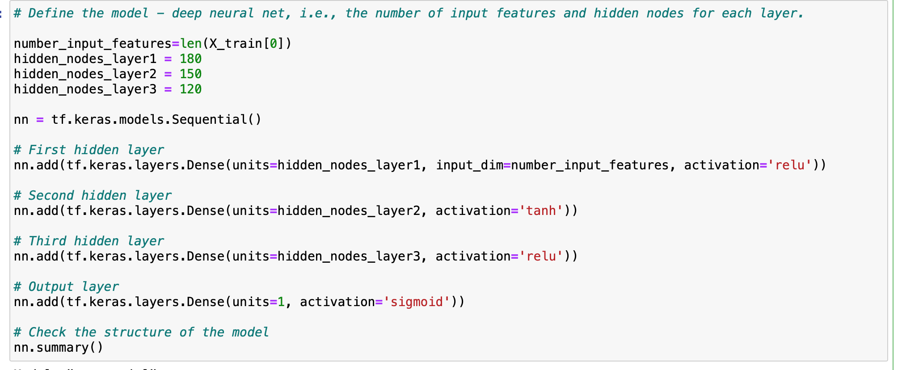
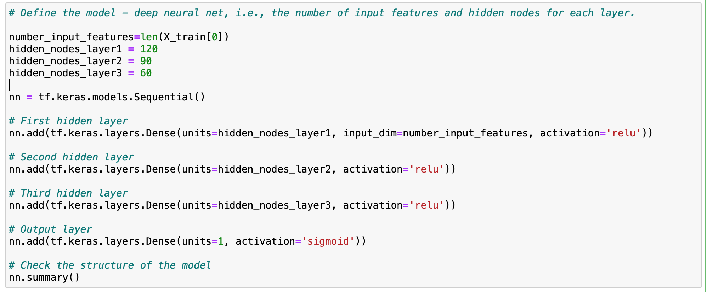
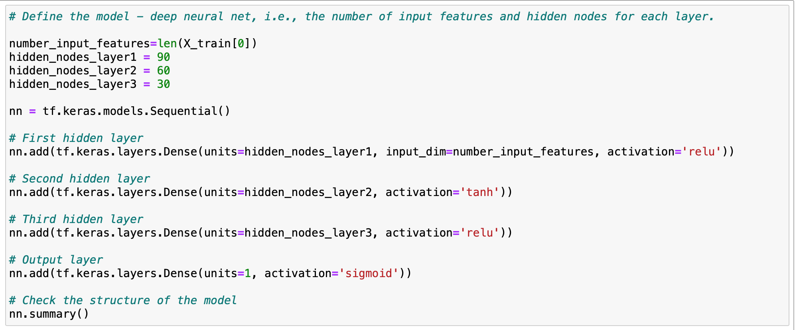

# Neural_Network_Charity_Analysis

## Overview of the analysis:

The purpose of this project was to create a binary classifer that will predict which applicants applying for Alphabet Soup's charity will be successful using Machine Learning and Neural Networks. In order to use machine learning, I looked at a dataset containing various measures on 34,000 organizations that have been funded and followed three steps
* Data Preprocessing
* Compiling, Training, and Evaluating the Model
* Model Optimization

## Results: 

### Data Preprocessing
* **What variable(s) are considered the target(s) for your model?**
  * The variables considered as the target for the model was the column 'IS_SUCCESSFUL'. 
* **What variable(s) are considered to be the features for your model?**
  * APPLICATION_TYPE, AFFILIATION, CLASSIFICATION, USE_CASE, ORGANIZATION, STATUS, INCOME_AMT, SPECIAL_CONSIDERATION, and ASK_AMT are all potential variables that could be considered as features for the model, although part of the optimization may be dropping a few that may not be effective in helping the model predict outcomes accurately. 
* **What variable(s) are neither targets nor features, and should be removed from the input data?**
  * Columns EIN and NAME was variables that are neither targets nor features since they are each unique to each organization and should be removed since they are identifiers and have no impact on the outcomes. 

### Compiling, Training, and Evaluating the Model
* **How many neurons, layers, and activation functions did you select for your neural network model, and why?**
 * In my first optimization, I added the standard 3 hidden layers - relu, tahn, relu and activation sigmoid. The first layer had 180 noeds, the second 150, and the third 120 to keep them divisible by 3. 
  
 * Since my first attempt at optimization failed to meet the 75% accuracy threshold, I dropped more columns 'STATUS' and 'SPECIAL_CONSIDERATIONS" and lessened the nodes to start at 120 on the first layer, go down to 90 on the second, and 30 on the third. I also changed all hidden layers besides activation to relu since in past activities, I had success using the relu, relu, relu, sigmoid activation. 
   
 * In my third optimization, I dropped one more column "USE_CASE" and decreased the nodes since I was starting to see a fall in accuracy possible due to overfitting/overtraining. The nodes started at 90 for the first layer, 60 for the second, and 30 for the third. I went back to relu, tahn, relu with the sigmoid activation since i saw a bigger jump in accuracy witht the first optimization compared to the second. 
  
* **Were you able to achieve the target model performance?**
* I was not able to achieve the target model performance, but I did get close, finishing at over 73%, 2% from the target accuracy at 75%. 
* **What steps did you take to try and increase model performance?**
* The steps I took on each optimization was dropping columns to hopefully reduce the noise in the model, change the nodes and hidden layers to try and optimize performance, and try to prevent overfitting. 

## Summary:
The model ended up with the accuracy score of 73% after optimization. The initial neural network had a accuracy score of 51%. Althogh the model increased in accuracy, it was not able to obtain the goal of over 75% after three tries of optimization.  Further tweaking may be required, but also overfitting may become an issues as the accuracy started decreasing after 100 epochs. To help improve the models accuracy, further tweaking(removing columns, changing hidden layers, ect) may be needed or additional data to help the training model improve its accuracy.

